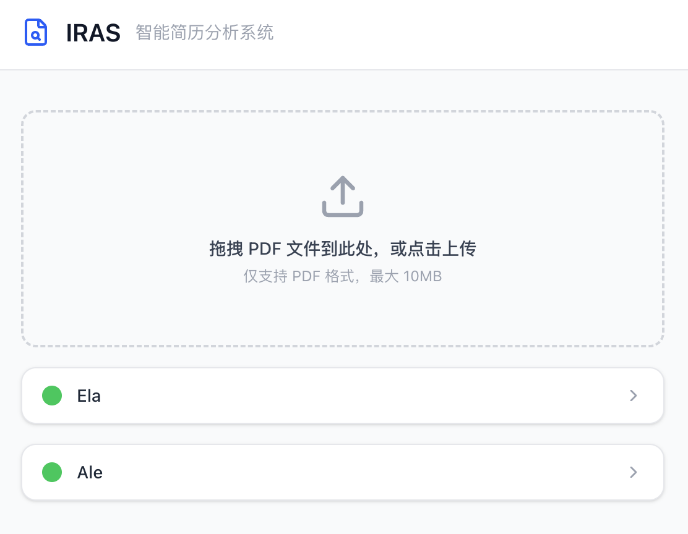
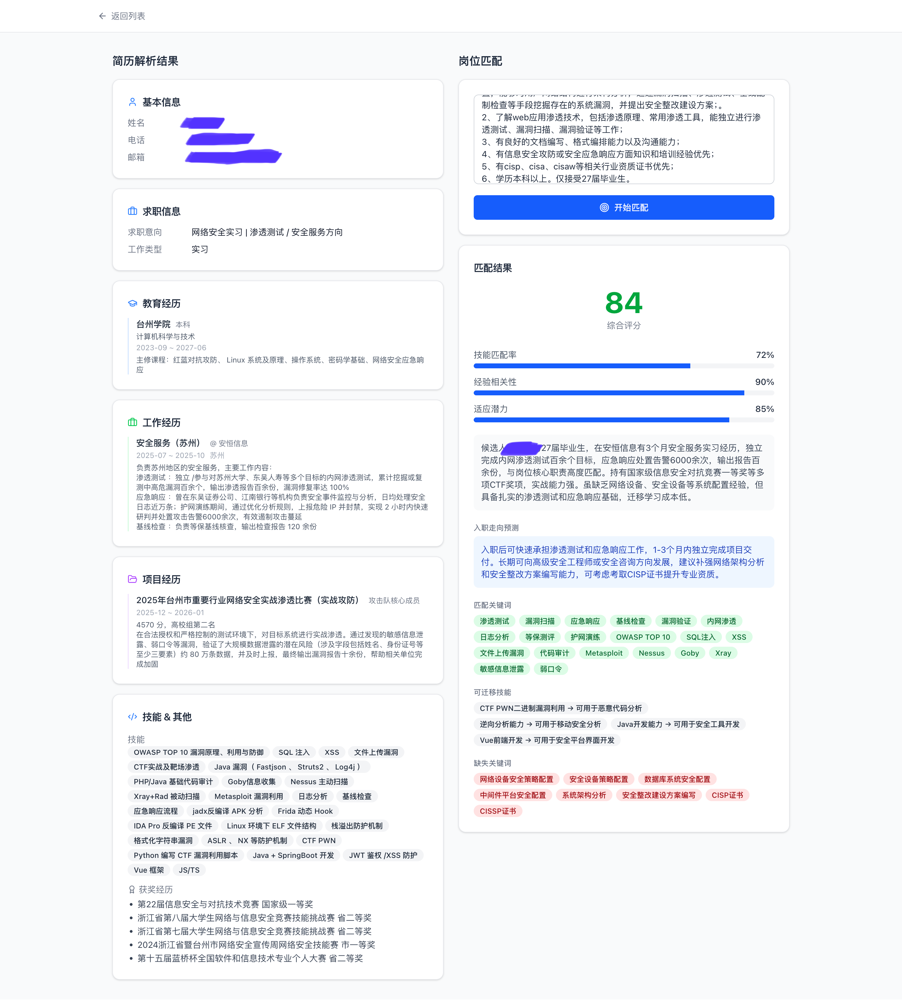

# IRAS

AI 赋能的简历解析、关键信息提取与岗位匹配平台。

## DEMO





## 功能说明

- **PDF 解析**：优先直接提取文本；扫描件（文本 < 100 字符）自动调用 DeepSeek VL OCR
- **信息提取**：GLM-5.1 从简历文本中提取姓名、联系方式、教育/工作/项目经历、技能等结构化字段
- **智能评分**：GLM-5.1 对简历与 JD 进行综合评分，输出技能匹配率、经验相关性、适应潜力、关键词分析及成长预测
- **缓存加速**：Redis 缓存解析结果（24h TTL），相同 PDF 和相同 JD 组合命中缓存直接返回，不重复调用 LLM
- **会话隔离**：基于 Cookie 的轻量级会话，每个用户只能访问自己上传的简历

## 快速开始

### 前置条件

- Python 3.13+
- Node.js 20+
- Redis（本地运行或 Docker）
- 硅基流动 API Key（[申请地址](https://cloud.siliconflow.cn)）

### 后端

```bash
cp .env.example .env
# 编辑 .env，填入 SILICONFLOW_API_KEY
uv run uvicorn app.main:app --reload
```

API 文档：http://localhost:8000/docs

### 前端

```bash
cd web
npm install
npm run dev
```

访问：http://localhost:5173

### Redis（Docker）

```bash
docker run -d -p 6379:6379 redis:alpine
```

## 环境变量

| 变量 | 默认值 | 说明 |
|---|---|---|
| `SILICONFLOW_API_KEY` | — | 硅基流动 API Key（必填） |
| `SILICONFLOW_BASE_URL` | `https://api.siliconflow.cn/v1` | API 基础 URL |
| `REDIS_URL` | `redis://localhost:6379` | Redis 连接地址 |
